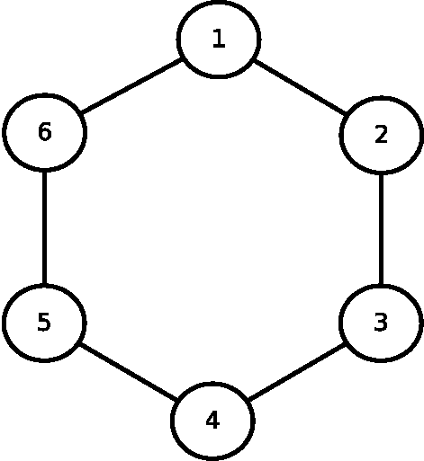
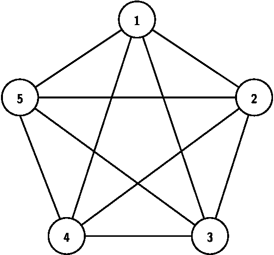
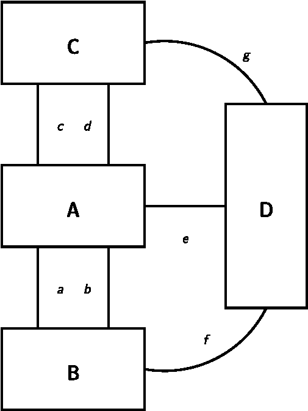

# Koenigsberg (alpha version)

A graph analysis tool by <a rel="author" href="https://patrickbrianmooney.nfshost.com/~patrick/">Patrick Mooney</a>.The most recent version can be found <a rel="me author" href="https://github.com/patrick-brian-mooney/Koenigsberg">on GitHub</a>.

Koenigsberg is copyright 2022 by Patrick Mooney. It is licensed under the GNU GPL, either version 3 or, at your option, any later version. See the [LICENSE.md file](../LICENSE.md) for details.

## Requirements

Koenigsberg requires Python (version 3.9 or above) and Cython (at least version 0.32), plus a working C compiler that is set up to work with Cython.  

## Installation

First, be sure that a C compiler is installed in a location and manner that allows Cython to find it. Under Debian, Ubuntu, and related Linuxes, `sudo apt install build-essential` will install everything needed at the system level and allow Cython to be installed with `pip`, as described below. Users of other operating systems should look at the instructions on the [installing Cython](https://cython.readthedocs.io/en/latest/src/quickstart/install.html) webpage.

    git clone patrick-brian-mooney/Koenigsberg
    cd Koenigsberg
    pip install -r requirements.txt

`pip` will then install Cython, a recent version of which is currently the only requirement. (Older versions of Cython may not work; recent versions are required because they fix a problem with correctly determining the length of bytearrays.) If `pip` is not already installed properly on your system, you may need to [install pip](https://pip.pypa.io/en/stable/installation/) first.

Installing Cython manually and separately is not generally necessary, but this may not be true for your particular setup; see [installing Cython](https://cython.readthedocs.io/en/latest/src/quickstart/install.html) for instructions if `pip` does not automatically set up Cython for you.

## Overview

Koenigsberg brute-forces certain problems in graph theory that are analogous to "the Königsberg Bridge Problem," which was solved without brute-forcing it by by Leonard Euler in 1735; see Teo Paoletti's [writeup](
https://www.maa.org/press/periodicals/convergence/leonard-eulers-solution-to-the-konigsberg-bridge-problem) for an overview of this problem and Euler's solution.

"Königsberg problems," as this program calls them, are problems in graph theory that meet these two criteria:

1. the graph represents nodes that are  connected by pathways; and 
2. the problem is to attempt to find a pathway through the network that traverses each connection exactly once.

Koenigsberg provides a set of tools to help solve these problems by brute force: it is a command-line program that operates on pre-created graph- and map-description files describing the connections between nodes and networks. It is also a set of Python libraries that allow these pre-defined libraries to be scripted using the Python programming language.

## Quick start

*note:* Windows users may need to adapt the commands in this section by replacing forward slashes (`/`) used as path separators with back slashes (`\`). MacOS users and users of other Unix-based operating systems may need to prefix the program nam `koenigsberg.py` with a dot and a slash (so that it becomes `./koenigsberg.py`) if they are running the program from the current directory. Users of any operating system may find that explicitly specifying the full path to the executable is the easiest way to work around problems in this area. If your system is not detecting properly that `koenigsberg.py` should be run using the Python interpreter, you may need to specify that explicitly on the command line by prefixing the command with the name of and/or full path to the Python interpreter, which may be called `python`, `python3`, `python.exe`, `python3.exe`, or something else on your system. Check your own installation for details.

To start: try

    koenigsberg.py --help
    
to see a list of comand-line options, or 

    koenigsberg.py --version
    
to print out the current version of Koenigsberg (and the version of Python it is running under).

The first time you run `koenigsberg`, it will build its extension modules; please be patient as this may take a minute or two on slower systems.

### First run

To analyze a simple (trivial, even) graph structure provided in a sample data file, try

    koenigsberg.py --graph sample_data/hex_ring.graph

You should see output that looks like this:

    ('1', '2') -> ('2', '3') -> ('3', '4') -> ('4', '5') -> ('5', '6') -> ('1', '6')
    ('1', '6') -> ('5', '6') -> ('4', '5') -> ('3', '4') -> ('2', '3') -> ('1', '2')
    ('1', '2') -> ('1', '6') -> ('5', '6') -> ('4', '5') -> ('3', '4') -> ('2', '3')
    ('2', '3') -> ('3', '4') -> ('4', '5') -> ('5', '6') -> ('1', '6') -> ('1', '2')
    ('2', '3') -> ('1', '2') -> ('1', '6') -> ('5', '6') -> ('4', '5') -> ('3', '4')
    ('3', '4') -> ('4', '5') -> ('5', '6') -> ('1', '6') -> ('1', '2') -> ('2', '3')
    ('3', '4') -> ('2', '3') -> ('1', '2') -> ('1', '6') -> ('5', '6') -> ('4', '5')
    ('4', '5') -> ('5', '6') -> ('1', '6') -> ('1', '2') -> ('2', '3') -> ('3', '4')
    ('4', '5') -> ('3', '4') -> ('2', '3') -> ('1', '2') -> ('1', '6') -> ('5', '6')
    ('5', '6') -> ('1', '6') -> ('1', '2') -> ('2', '3') -> ('3', '4') -> ('4', '5')
    ('1', '6') -> ('1', '2') -> ('2', '3') -> ('3', '4') -> ('4', '5') -> ('5', '6')
    ('5', '6') -> ('4', '5') -> ('3', '4') -> ('2', '3') -> ('1', '2') -> ('1', '6')

Koenigsberg is examining the graph in the `hex_ring.graph` file and seeking all paths through it that cross each pathway between nodes exactly once, and printing the list of pathways that so ao.

The graph in that file looks like this:

Each node in the network above is given a name -- in this case, a number, using the numbers one through six. There are (unnamed) pathways between the numbers; when `koenigsberg` loads the .graph file, it automatically names those pathways: `('1', '2')` is the name given to the pathway that connects node `'1'` with node `'2'`; `('2', '3')` is the name of the pathway connecting node `'2'` to node `'3'`; and so forth. Nodes need not be named using numbers; any textual string can be used to name them. So a .graph file can contain nodes named, for instance, `'Paris'` and `'Rouen'`; in this case, if there is a pathway connecting them, it will be automatically named `('Paris', 'Rouen')`, with the node names in alphabetical order. (It is not possible to override the automatic names given to pathways in a .graph file, nor is it possible in a .graph file for two nodes to be connected by more than a single pathway. Both of these restrictions are lifted in .map files, which support a more complex file format &mdash; also a file format that is more tedious to create.)

Having loaded the map data and named the pathways, Koenigsberg then attempts to find all possible ways to traverse the map, starting from any node, in which each pathway is traversed exactly once. When it finds such a pathway, it prints it out. So the first line in the sample output above means that one way to traverse the map that meets the "pass through each pathway exactly once" constraint is:

* Move down the pathway `('1', '2')`; then
* move down the pathway `('2', '3')`; then
* move down the pathway `('3', '4')`; then
* move down the pathway `('4', '5')`; then
* move down the pathway `('5', '6')`; then
* move down the pathway `('1', '6')`; and every pathway has been traversed.

There are of course eleven other possible solutions to this map meeting the given constraint; they are also printed.

### Another example

Imagine a pentagon in which each vertex is a node in a graph and each node is connected to every other node by a pathway:

How many possible paths are there through this network that pass through each connecting pathway exactly once? Let's find out:

    koenigsberg.py --graph sample_data/pentagon.graph

Koenigsberg prints out every valid answer; the answer list ends with

        [...]
    
    ('4', '5') -> ('3', '4') -> ('3', '5') -> ('2', '5') -> ('1', '2') -> ('1', '4') -> ('2', '4') -> ('2', '3') -> ('1', '3') -> ('1', '5')
    ('4', '5') -> ('3', '4') -> ('3', '5') -> ('2', '5') -> ('2', '3') -> ('1', '3') -> ('1', '2') -> ('2', '4') -> ('1', '4') -> ('1', '5')
    ('4', '5') -> ('3', '4') -> ('3', '5') -> ('2', '5') -> ('2', '3') -> ('1', '3') -> ('1', '4') -> ('2', '4') -> ('1', '2') -> ('1', '5')
    ('4', '5') -> ('3', '4') -> ('3', '5') -> ('2', '5') -> ('2', '4') -> ('1', '4') -> ('1', '2') -> ('2', '3') -> ('1', '3') -> ('1', '5')
    ('4', '5') -> ('3', '4') -> ('3', '5') -> ('2', '5') -> ('2', '4') -> ('1', '4') -> ('1', '3') -> ('2', '3') -> ('1', '2') -> ('1', '5')
    All paths examined!
        2640 solutions found!

and there's the answer: there are 2640 valid pathways through the network that traverse each connection exactly once.

### The original Königsberg bridges problem

The basic structure of the Königsberg bridges problem looks like this:

Note that some pairs of nodes in this network are connected by multiple bridges, which is why the data is represented by a .map, rather than a .graph, file; .map files have additional information that allows for multiple paths to exist connecting any pair of nodes (and for paths to be named).

To brute-force this graph, try:

    koenigsberg.py --map sample_data/Königsberg.map 
    
(If your keyboard does not have an **ö** key, you may find it helpful to use your terminal's tab-completion feature, or to cut and paste the file name or the letter.) Note that the command-line interface requires the use of the `--map` switch, instead of the `--graph` switch, to load a map file. (Conversely, the `--map` switch will only load .map, not .graph, files.)

This produces:

    All paths examined!
        No solutions found!

This matches up with Euler's 1735 proof, which he performed deductively rather than by brute-forcing the problem. (But he didn't have a computer, either.)

## Creating .map and .graph files

The easiest way to create a .map or a .graph file to use the (included) `map_wizard` program, which will prompt the user for information repeatedly until the entire map (or graph) is created, then write the relevant data out to disk in a file of the appropriate format.

To get started, type:

    map_wizard.py
    
and answer the questions.

### Creating .graph files by hand (or programmatically)

A .graph file is just a JSON file that encodes a Python dictionary following these rules:

1. Each key is a node name.
2. The value that each key indexes is a list of node names indicating which nodes the node mentioned in the key is connected to.

Node names must be strings.

Here is a sample:

    {
      "1": [
        "2",
        "4"
      ],
      "2": [
        "1",
        "3"
      ],
      "3": [
        "2",
        "4"
      ],
      "4": [
        "1",
        "3"
      ]
    }

This file describes a network with four nodes: `'1'`, `'2'`, `'3'`, and `'4'`. Node 1 is connected to nodes 2 and 4 (but not to node 3); node 2 is connected to nodes 1 and 3 (but not to node 4); node 3 is connected to nodes 2 and 4 (but not to node 1), and node 4 is connected to nodes 1 and 3 (but not to node 2).

Any valid JSON file that encodes such a dictionary is a valid .map file for Koenigsberg. "Valid" includes not only strictly-valid files under the original, strict version of the JSON standard, but any JSON file that [Python's `json` module](https://docs.python.org/3.9/library/json.html) can read.

When loading a .graph file from the command line, the `--graph` switch (and not the `--map` switch) must be used to load it.

### Creating .map files by hand (or programmatically)

Like .graph files, .map files are valid JSON files encoding a Python dictionary with a particular structure. As with .graph files, any JSON-encoded file that Python can read and that has the appropriate structure is a valid .map file for Koenigsberg. However, .map files have a more complex structure than .graph files do.

Every valid .map file encodes a Python dictionary with two keys with specific names at the top level. Each of those keys must index another dictionary with a defined structure. The mandatory names of these two mandatory keys are `"nodes to paths"` and `"paths to nodes"`. As might be expected, the first dictionary must have a key for each node, and that key must index a list of paths that connect to that node. The second dictionary must have a key for each path, and that key must index a list that indicates which two (exactly) nodes that path connects. Paths that appear in either dictionary must also appear in the other; nodes that appear in either dictionary must also appear in the other. 

Node names and path names must be strings.

Here is a sample .map file that encodes the original Königsberg Bridges Problem:

    {
      "nodes to paths": {
        "A": [
          "a",
          "b",
          "c",
          "d",
          "e"
        ],
        "B": [
          "a",
          "b",
          "f"
        ],
        "C": [
          "c",
          "d",
          "g"
        ],
        "D": [
          "e",
          "f",
          "g"
        ]
      },
      "paths to nodes": {
        "a": [
          "A",
          "B"
        ],
        "b": [
          "A",
          "B"
        ],
        "c": [
          "A",
          "C"
        ],
        "d": [
          "A",
          "C"
        ],
        "e": [
          "A",
          "D"
        ],
        "f": [
          "B",
          "D"
        ],
        "g": [
          "C",
          "D"
        ]
      }
    }
    
When loading a `--map` file from the command line, the `--map` switch (and not the `--graph` switch) must be used to load it.

## Saving the progress of an exploration run

Koenigsberg can save the progress of a map exploration and resume that progress on a later run, which can be quite handy if a map exploration takes a long time. On the other hand, map exploration is slower when Koenigsberg needs to track and save its progress. Progress checkpointing happens at defined intervals, not continuously.

The following command-line options control progress checkpointing.

  --checkpoint-file CHECKPOINT_FILE, --check CHECKPOINT_FILE, -c CHECKPOINT_FILE

This option specifies a file (possibly preceded by a full or relative path) to save and restore checkpointing data to. If unspecified, no checkpoints will be created, and all other options in this section will be ignored.

  --checkpoint-length CHECKPOINT_LENGTH, --check-len CHECKPOINT_LENGTH, -e CHECKPOINT_LENGTH

Lengths of paths that cause a checkpoint to be created; larger numbers lead to less frequent saves. Koenigsberg *may* (subject to other criteria, such as minimum time between saves) create a checkpoint when it exhausts a pathway of this length or a multiple of this length. For instance, if the `checkpoint-length` is 10 (the default), saves may be created when abandoning a path of length 10, 20, 30, 40, 50, 60 ... 

This number must not be changed during a run, even if the run is stopped and resumed. The easiest way to ensure that this number does not change is to leave it at its default value by not using this option.

  --min-save-interval MIN_SAVE_INTERVAL, --min-save MIN_SAVE_INTERVAL, -n MIN_SAVE_INTERVAL

Minimum amount of time, in seconds, between checkpointing saves. Increasing this makes the program explore a map slightly faster but means you'll lose more progress if it's interrupted.

  --prune-exhausted-interval PRUNE_EXHAUSTED_INTERVAL, -p PRUNE_EXHAUSTED_INTERVAL

If Koenigsberg is tracking and checkpointing its own progress, it keeps a list of paths that have already been fully explored so it can avoid exploring them again. This information needs to be cleaned up periodically because it gradually comes to contain redundant information, which causes the "have we already explored this branch of the graph?" detection to become very slow. Pruning this information takes time itself, but makes the rest of the program run much faster. 

This option controls the threshold for cleaning up the list of paths we've exhausted. The default value is currently 1000 (though this is subject to change in future versions), which means "clean up the list when we've added at least 1000 entries to it since the last time we cleaned it, or the beginning of the run, whichever applies." The *optimal* value depends on your system and on the shape of the map you're exploring, and you may find it worthwhile to experiment with different values for this parameter to see if it speeds up your run. 

Koenigsberg sometimes detects that the tracking data needs to be pruned independently of this parameter (for instance, it always prunes this data right before creating a checkpointing save), and it may not prune after adding *exactly* this number of paths, so this parameter should be treated as making a suggestion to the program, not issuing a command.

Unlike `--checkpoint-length`, it is perfectly safe to change this parameter when continuing an exploration run from a progress-checkpoint file.  

## Other command-line options  

    -h, --help            

Show a help message with brief information about command-line parameters and some other useful information, then exit.

    --version, --vers, --ver

Display version information and exit.

    --verbose, -v
    
Increase how chatty the program is about the progress it makes. May be specified multiple times to make the program increasingly chatty about its own progress.

    --graph GRAPH, -g GRAPH

Specify an appropriately formatted .graph file to solve exhaustively. Exactly one of `--map` and `--graph` must be specified to explore a graph.

    --map MAP, -m MAP

Specify an appropriately formatted .map file to solve exhaustively. Exactly one of `--map` and `--graph` must be specified to explore a graph.

    --abandoned-report-length-interval ABANDONED_REPORT_LENGTH_INTERVAL, --abandoned-length ABANDONED_REPORT_LENGTH_INTERVAL, -a ABANDONED_REPORT_LENGTH_INTERVAL

Length of paths that cause a status message to be emitted when the path is abandoned at verbosity level 3 or above.

    --abandoned-report-number-interval ABANDONED_REPORT_NUMBER_INTERVAL, --abandoned-number ABANDONED_REPORT_NUMBER_INTERVAL, -r ABANDONED_REPORT_NUMBER_INTERVAL

Length of paths that cause a status message to be emitted when the path is abandoned at verbosity level 3 or above.

## Using Koenigsberg from other Python (or Cython) code

Koenigsberg supplies Python/Cython modules that can be used from other code if desired. Pre-building `.pyx` (Cython) files into C-style extension modules would probably be helpful in at least some circumstances for at least some people; see [Building Cython Code](https://cython.readthedocs.io/en/latest/src/quickstart/build.html) in the Cython documentation to get started.

### Overview of most-useful routines

#### Reading data from disk and converting it to a useful format

Any data describing the structure of a graph that you pass to Koenigsberg must first be "normalized," i.e. converted into the format that Koenigsberg uses internally.

* `util.normalize_dicts()` does this, producing a set of data for internal use from a `paths_to_nodes` dictionary and a `nodes_to_paths` dictionary (as is used internally to store graphs in the .map format).
* A pair of `paths_to_nodes`/`nodes_to_paths` dictionaries can be produced from the format used in .graph files by `util.graph_to_dicts()`.

`util.graph_to_dicts()` returns a two-tuple:

0. a `paths_to_nodes` dictionary, mapping each path to the two nodes it connects; and 
1. a 'nodes_to_paths` dictionary, mapping each node to all of the paths it connects to.

`util.normalize_dicts()` returns a six-tuple representing the information that Koenigsberg needs to work with while exploring a graph:

1. a normalized PATHS_TO_NODES dictionary that uses the integer IDs that Koenigsberg needs to work with;
2. a normalized NODES_TO_PATHS dictionary that uses the integer IDS that Koenigsberg needs to work with;
3. a dictionary mapping integer path IDs to the human-supplied path descriptions;
4. a dictionary mapping integer node IDs to the human-supplied node descriptions;
5. a dictionary mapping human-supplied path descriptions to integer path IDs;
6. a dictionary mapping human-supplied node descriptions to integer node IDs.

That is, `normalize_dicts()` returns versions of `path_to_nodes` and `nodes_to_paths` dictionaries that use ID numbers that are compatible with Koenigsberg, instead of whatever strings may have been used to store the data; plus it returns two more (forward- and reverse-) mapping dictionaries for each dictionary passed in, which can be used to convert between the names you gave the nodes/connections and the ID numbers that `normalize_dicts()` assigned.

The zeroth and first elements of the tuple can be passed to `solve_from()` and related functions in `koenigsberg_lib.py`, described below.

#### Exhaustively exploring graphs (using code in `koenigsberg_lib.pyx`)

`solve_from()`, `solve_from_multiple()`, and `solve_from_all()` provide friendly interfaces to the map-exploration code. 

`solve_from()` explores a graph, starting only from a single node. `solve_from_multiple()` explores a map from multiple starting nodes. `solve_from_all()` is a convenience function that calls `solve_from_multiple()` while specifying a list of all starting nodes.

The dictionaries passed to the `solve_from()` family of functions need to be dictionaries containing ID numbers, not strings or other Python objects. Dictionaries of this type can be produced by `utils.normalize_dicts()`.

#### Other utility code 

For the functions listed below, use `help(FUNCTION_NAME)` to read the docstring describing the function. (Press Q to return to your Python interpreter.)  

* `koenigsberg.read_graph_file()` and `koenigsberg.read_map_file()` read .graph and .map files, respectively, returning their data after performing basic sanity checks.
* `koenigsberg_lib.reset_data()` resets all tracking data related to the current run. Doing this in the middle of a run will cause weird errors. Doing this after a run, before beginning another run, will help to avoid having one run's data pollute the next run.
* `koenigsberg_lib.print_all_dict_solutions()`, `koenigsberg_lib.print_single_dict_solutions()`, and `koenigsberg_lib.print_all_graph_solutions()` are convenience interfaces to `solve_from_all()` that handle normalizing the relevant dictionaries for you. (`print_all_graph_solutions()` also handles donverting a graph into a pair of dictionaries first.) Each of these functions can take an optional `output_formatter` argument: a function that turns a bytearray of internal integral IDs used by Koenigsberg into a textual representation of the path used when printing out the path. Take a look at how `utils.default_path_formatter()` uses `functools.partial()` to attach information to `utils._default_path_formatter()` for an example of how this can be done.
* `utils.maximally_dense_network_graph()` constructs and returns a map-style network in which each node is connected to each other node. It can be useful for quick tests.   

## Bugs

There are probably bugs. Please [report them](https://github.com/patrick-brian-mooney/Koenigsberg/issues) at the project's page [on GitHub](https://github.com/patrick-brian-mooney/Koenigsberg). Errors and substantial omissions in the documentation are also considered bugs and reports of such are highly appreciated.

Questions, offers to collaborate, inquiries about where to send large sums of money, etc., should also be directed through GitHub. 

## Known limitations

* Koenigsberg cannot explore graphs that have more than 255 connections between nodes. (Though if you have such a map, and that map is non-trivial, Koenigsberg would be so slow at exploring it that it would in any case be an inappropriate tool.)
* Koenigsberg has no way to represent graphs with one-way connections.
* Changing the `--checkpoint-length` option to something different from what it was at the beginning of a run -- say, by restarting a run from a saved data file, and using a different value as the `--checkpoint-length` -- may lead to erroneous results.
* Koenigsberg takes reasonable care to detect nonsense data that is supplied to it, but it's probably possible to construct data files that are malformed in ways it cannot detect.
